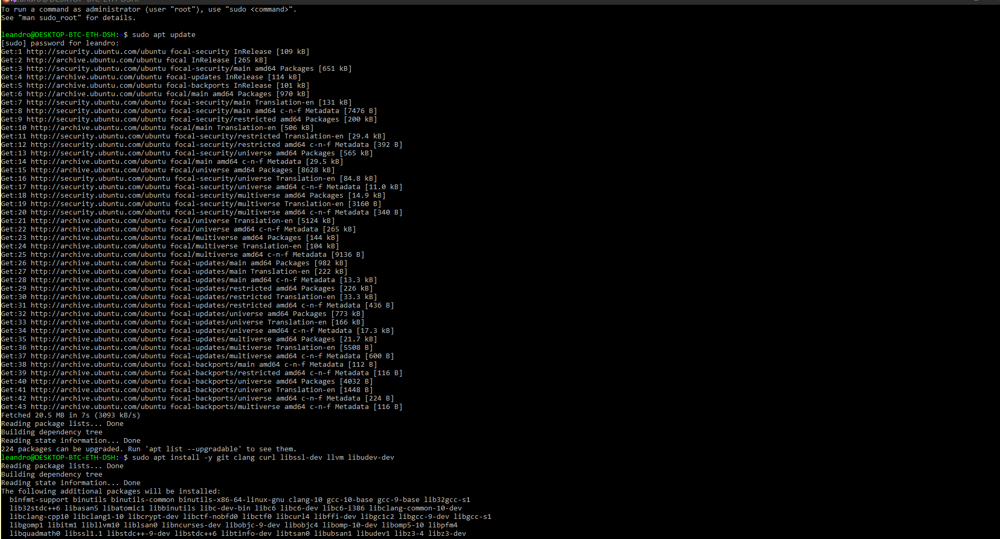
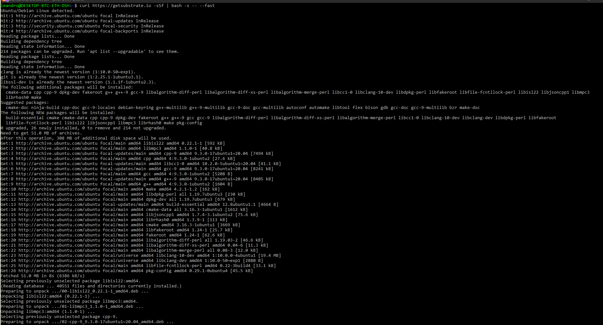

Exercise One

1.Setup development environment
2.Fork & clone this project
3.Update author in Cargo.toml file
4.Run a single node testnet and send a transaction

------------------------------------------------------------------------------------------------------

1. Setup was made using Ubuntu 20.04 (WSL for windows)

2. https://github.com/GitLeandroHub/exercise-1-and-2

3.Git commit update authors:
3.1 https://github.com/GitLeandroHub/exercise-1-and-2/tree/master/node
3.2 https://github.com/GitLeandroHub/exercise-1-and-2/tree/master/pallets/template
3.3 https://github.com/GitLeandroHub/exercise-1-and-2/tree/master/runtime

4. https://ipfs.io/ipns/dotapps.io/#/accounts (127.0.0.1:9944)

